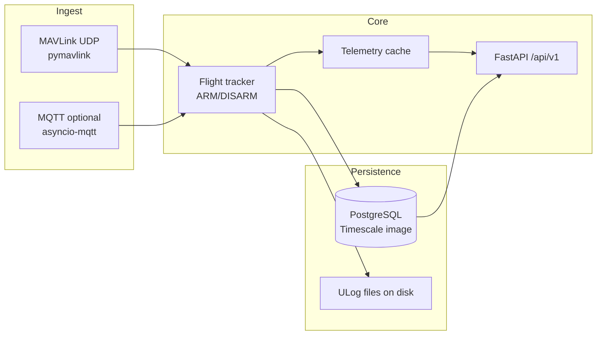

<p align="center">
  <strong>Drone Telemetry</strong><br/>
  <sub>Live MAVLink ingest · REST + WebSocket API · Flight history · PX4 ULog storage</sub>
</p>

---

## Overview

**Drone Telemetry** is an end-to-end telemetry stack for PX4-style drones: **MAVLink over UDP** is normalized and tracked in **PostgreSQL**, while **FastAPI** exposes **versioned REST** and **WebSocket** endpoints for operators and dashboards. Flights are segmented from **ARM/DISARM** heartbeats (with recovery and cleanup), and per-flight samples power replay and analysis. **PX4 ULog** files can be uploaded and listed per flight.

This repository ships the **backend**, **Docker Compose** orchestration, optional **SITL/MAVSDK** helpers under `mavsdk/`, and a small **React + Vite** UI under `frontend/` for local demos.

---

## Why it exists

| Capability | What you get |
|------------|----------------|
| **Live fleet** | Latest telemetry per drone in memory; WebSocket stream with versioned updates |
| **History** | Flights with duration, extrema, battery bookends, GPS/emergency counters, optional JSON summary |
| **Post-flight** | Paginated `flight_telemetry`; multipart **ULog** upload + metadata |
| **Integrations** | Optional **MQTT** subscriber and fleet summary publisher (Eclipse Mosquitto in Compose) |

---

## Architecture



- **Authoritative path:** UDP listeners bind a **configurable port range** (default **14540–14639**) — one logical drone per destination port (`udp:<port>`).
- **Optional path:** Set `INGEST_ENABLE_MQTT_LISTENER=true` to consume telemetry from the broker (default in code is **off**).
- **API:** In-memory **latest-only** cache (bounded by `MAX_DRONES`, default **200**) with **stale/offline** semantics; historical data comes from SQL.

---

## Tech stack

| Layer | Technologies |
|-------|----------------|
| **API** | Python 3.11, **FastAPI**, **Uvicorn**, Pydantic / pydantic-settings |
| **Database** | **SQLAlchemy 2** (async), **asyncpg**, **PostgreSQL** (Compose uses **timescale/timescaledb** image) |
| **MAVLink** | **pymavlink** (PX4-oriented message set) |
| **MQTT** | **asyncio-mqtt**, **paho-mqtt** |
| **Ops** | **Docker Compose**, Eclipse **Mosquitto** |
| **Demo UI** | **React 19**, **Vite 7**, **Tailwind CSS** (`frontend/`) |

---

## Quick start (Docker Compose)

**Prerequisites:** [Docker](https://docs.docker.com/get-docker/) and Docker Compose v2.

```bash
# From repository root — starts DB, Mosquitto, and backend (HTTP 8000, MQTT 1883, UDP 14540–14639)
docker compose up -d --build
```

- **HTTP API:** `http://localhost:8000`  
- **OpenAPI docs:** `http://localhost:8000/docs`  
- **Health (versioned):** `GET http://localhost:8000/api/v1/health`  
- **ULog files:** host path `./data/ulogs` is mounted into the backend container.

### Optional: SITL + MAVSDK bridge (profile `sim`)

Starts the simulator and a MAVSDK drone script that publishes to MQTT and UDP (for local integration testing). **Binds UDP 14540** — do not run alongside a production backend on the same port.

```bash
docker compose --profile sim up -d --build
```

---

## Project layout

```
├── backend/           # FastAPI application (main package: app/)
├── docker-compose.yml
├── mosquitto/         # Broker config (mounted into Mosquitto container)
├── mavsdk/            # Simulator + MAVSDK Dockerfiles and scripts (optional)
├── frontend/          # React + Vite demo dashboard (optional)
└── data/ulogs/        # ULog storage (created/mounted in Compose)
```

---

## Configuration

Environment variables are read by `backend/app/config.py` (supports a `.env` file in the backend working directory). Highlights:

| Variable | Role | Default (code) |
|----------|------|----------------|
| `POSTGRES_*` | Database connection | Host `db`, DB name `telemetry` in code; Compose sets `drone_telemetry` |
| `UDP_BIND_START_PORT` / `UDP_BIND_END_PORT` | MAVLink UDP port span | `14540`–`14639` |
| `PUBLISH_RATE_HZ` | Ingest publish cadence | `5` |
| `WS_PUSH_HZ` | WebSocket push cadence | `5` |
| `STALE_AFTER_SEC` / `OFFLINE_AFTER_SEC` | Live status thresholds | `5` / `30` (Compose overrides stale to **10**) |
| `MAX_DRONES` | Telemetry cache cap | `200` |
| `INGEST_ENABLE_MQTT_LISTENER` | MQTT subscriber | `false` |
| `ULOG_STORAGE_DIR` | ULog filesystem root | `data/ulogs` |

See `docker-compose.yml` for the full set passed to the `backend` service.

---

## API surface (`/api/v1`)

| Method | Path | Description |
|--------|------|-------------|
| `GET` | `/health` | Service status, MQTT snapshot, uptime |
| `GET` | `/drones` | Fleet list + registry fields (UDP port, flight counts, etc.) |
| `GET` | `/drones/{id}/telemetry/latest` | Latest normalized telemetry (`410` if offline) |
| `WebSocket` | `/drones/{id}/telemetry/stream` | Stream when telemetry **version** changes |
| `GET` | `/drones/{id}/flights` | Flights for a drone (`limit` ≤ **200**, `offset`) |
| `GET` | `/flights/{id}` | Single flight summary |
| `GET` | `/flights/{id}/summary` | Alias of flight details |
| `GET` | `/flights/{id}/telemetry` | Paginated points (`limit` ≤ **500**, `total` in body) |
| `POST` | `/flights/{id}/ulog` | Multipart ULog upload |
| `GET` | `/flights/{id}/ulog` | List uploaded ULogs for the flight |
| `POST` | `/drones/{id}/telemetry/import` | CSV/JSON bulk import (creates flights + points) |
| `GET` | `/debug/mavlink/stats` | MAVLink ingest debug stats (if enabled) |

Unversioned **`GET /health`** on the app root mirrors MQTT/uptime for load balancers.

Interactive exploration: **`/docs`** (Swagger UI) and **`/redoc`**.

---

## Local development (backend without full Compose)

1. Start **PostgreSQL** (and optionally **Mosquitto**) — e.g. only DB and broker:  
   `docker compose up -d db mosquitto`
2. Install dependencies and run:

```bash
cd backend
python -m venv .venv
.venv\Scripts\activate   # Windows
# source .venv/bin/activate  # Linux/macOS
pip install -r requirements.txt
set POSTGRES_HOST=localhost
set POSTGRES_PASSWORD=example
set POSTGRES_DB=drone_telemetry
uvicorn app.main:app --reload --host 0.0.0.0 --port 8000
```

Point `POSTGRES_*` and optional MQTT variables at your services. The Docker image uses `wait-for-it.sh` to wait for the DB; local runs assume the database is already accepting connections after migrations on startup.

---

## Demo frontend (`frontend/`)

```bash
cd frontend
npm install
npm run dev
```

Configure the API base URL as needed for your environment (e.g. proxy or env pointing at `http://localhost:8000`). The UI is a lightweight **React + Vite** shell for exercising the API; production dashboards may live in a separate repo while using the same **`/api/v1`** contract.

---

## Security notes

- **CORS** is currently **permissive** (`allow_origins=["*"]`) — tighten before public deployment.
- There is **no built-in application authentication** on the API in this codebase; place the stack behind a gateway, VPN, or add auth as required by your environment.

---

## License

No license file is present in this repository at the root. Add a `LICENSE` file when you publish.

---

<p align="center">
  <sub>AstroX Aerospace · Drone Telemetry</sub>
</p>
